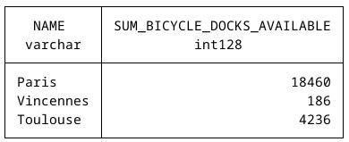
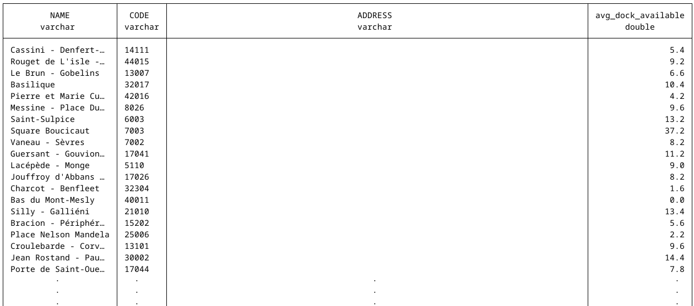

# Projet data engineer

Binome : Hanaa AKAN et Margaux LAIGLE

## Description du Projet

Ce projet vise à collecter, consolider et analyser des données liées à la mobilité urbaine, en particulier celles des stations de vélos et des communes. À l'origine, le code ne traitait que les données de la ville de Paris. Nous avons enrichi ce projet en y ajoutant les informations de toutes les communes de France ainsi que des stations de vélos de la ville de Toulouse.

## Architecture du projet

Nous avons 4 fichiers :

-   *data_ingestion* : fichier python pour récupérer et stocker les données dans des fichiers localement

-   *data_consolidation* : fichier python pour consolider les données et faire un premier load dans une base de données type data-warehouse

-   *data_agregation* : fichier python pour agréger les données et créer une modélisation de type dimensionnelle

-   *main* : fichier python qui permet d'exécuter l'ensemble du code

Le projet de base permet de récupérer les données de la ville de Paris, ses codes postaux ainsi que ses stations. Notre objectif étant d'étoffer la base de données en récupérant les informations de toutes les communes de France ainsi que les données des station de la ville de Toulouse.

Pour ce faire, nous avons modifié le code existant en ajoutant de nouvelles fonctions ou en les modifiant pour adapter le code existant à l'ajout de ces données.

### 1. Ingestion des données

Premièrement, nous nous sommes concentrées sur l'ingestion des données.

Nous avons intégré deux nouvelles sources de données : les communes de toute la France et les stations de vélos de Toulouse. Pour cela, nous avons utilisé des APIs ouvertes :

-   **L'API des communes françaises** pour récupérer les noms, codes INSEE, et populations des villes.

``` python
def get_city_data():
    """
    Récupère les données des villes françaises via une API et les sauvegarde.
    """
    # URL de l'API pour les données des communes françaises
    url = "https://geo.api.gouv.fr/communes"
    
    # Effectuer une requête GET pour récupérer les données
    response = requests.request("GET", url)
    
    # Sauvegarder les données en JSON
    serialize_data(response.text, "city_data.json")
```

Pour récupérer les données des communes, nous avons utilisé une API publique qui retourne des informations sur toutes les communes françaises. Nous avons sauvegardé ces données sous forme de fichier JSON.

-   **L'API de Toulouse Métropole** pour collecter en temps réel les données sur les stations de vélos, incluant leur capacité et le nombre de vélos disponibles.

``` python
def get_toulouse_realtime_bicycle_data():
    """
    Récupère les données en temps réel des vélos à Toulouse via une API et les sauvegarde.
    """
    # URL de l'API pour les données des vélos à Toulouse en temps réel
    url = "https://data.toulouse-metropole.fr/api/explore/v2.1/catalog/datasets/api-velo-toulouse-temps-reel/exports/json"
    
    # Effectuer une requête GET pour récupérer les données
    response = requests.request("GET", url)
    
    # Sauvegarder les données en JSON
    serialize_data(response.text, "toulouse_realtime_bicycle_data.json")
```

Pour les stations de vélos de Toulouse, une API dédiée nous a permis de collecter en temps réel des informations telles que le nombre de vélos disponibles et la capacité des stations. Là aussi, les données ont été sauvegardées en JSON avant d'être transformées.

Ces nouvelles données ont été récupérées et stockées sous forme de fichiers JSON, prêtes à être consolidées dans notre base de données.

### 2. Consolidation des données

Ensuite, une fois les données collectées, nous les avons insérées dans des tables consolidées.

\
Les données des communes ont été transformées pour conserver uniquement les colonnes pertinentes : code INSEE, nom de la commune et population.

``` python
def consolidate_city_data():
    """
    Consolidation des données des villes.
    """
    con = duckdb.connect(database="data/duckdb/mobility_analysis.duckdb", read_only=False)
    data = {}

    # Charger les données JSON des villes
    with open(f"data/raw_data/{today_date}/city_data.json") as fd:
        data = json.load(fd)

    # Normaliser les données JSON en DataFrame
    raw_data_df = pd.json_normalize(data)

    # Sélectionner et renommer les colonnes
    city_data_df = raw_data_df[["code", "nom", "population"]]
    city_data_df.rename(columns={
        "code": "id",
        "nom": "name",
        "population": "nb_inhabitants"
    }, inplace=True)

    # Éliminer les doublons
    city_data_df.drop_duplicates(inplace=True)

    # Ajouter une colonne pour la date
    city_data_df["created_date"] = date.today()
    print(city_data_df)
    
    # Insérer les données dans la table consolidée
    con.execute("INSERT OR REPLACE INTO CONSOLIDATE_CITY SELECT * FROM city_data_df;")
```

Pour Toulouse, nous avons enrichi les données des stations avec les codes INSEE correspondants, permettant de relier chaque station à sa commune. Ces données ont ensuite été réparties dans deux tables :

-   Une table pour les informations statiques des stations (nom, adresse, capacité, etc.)

``` python
def consolidate_station_data_toulouse():
    """
    Consolidation des données de stations pour Toulouse.
    """
    con = duckdb.connect(database="data/duckdb/mobility_analysis.duckdb", read_only=False)
    data = {}
    
    # Charger les données brutes JSON
    with open(f"data/raw_data/{today_date}/toulouse_realtime_bicycle_data.json") as fd:
        data = json.load(fd)
    
    # Normaliser les données JSON en DataFrame
    toulouse_raw_data_df = pd.json_normalize(data)
    
    # Extraire les noms de villes uniques
    city_names = toulouse_raw_data_df["contract_name"].str.lower().unique()
    
    # Associer les noms des villes avec les codes INSEE
    city_to_insee = {}
    for city in city_names:
        city_insee = con.execute(
            "SELECT ID FROM CONSOLIDATE_CITY WHERE LOWER(NAME) = ?;",
            (city,)
        ).fetchone()
        if city_insee:
            city_to_insee[city] = city_insee[0]
        else:
            print(f"Attention : aucun code INSEE trouvé pour la ville {city}.")
    
    # Mapper les codes INSEE
    toulouse_raw_data_df["code_insee_commune"] = toulouse_raw_data_df["contract_name"].str.lower().map(city_to_insee)
    
    # Ajouter des colonnes nécessaires
    toulouse_raw_data_df["id"] = toulouse_raw_data_df["number"].apply(lambda x: f"{TOULOUSE_CITY_CODE}-{x}")
    toulouse_raw_data_df["created_date"] = date.today()
    toulouse_raw_data_df["status"] = toulouse_raw_data_df["status"].replace({"OPEN": "OUI", "CLOSE": "NON"})
    
    # Sélectionner et renommer les colonnes
    toulouse_station_data_df = toulouse_raw_data_df[[
        "id", "number", "name", "contract_name", "code_insee_commune", "address",
        "position.lon", "position.lat", "status", "created_date", "bike_stands"
    ]]
    toulouse_station_data_df.rename(columns={
        "number": "code",
        "position.lon": "longitude",
        "position.lat": "latitude",
        "contract_name": "city_name",
        "code_insee_commune": "city_code",
        "bike_stands": "capacity"
    }, inplace=True)

    # Insérer les données dans la table consolidée
    con.execute("INSERT OR REPLACE INTO CONSOLIDATE_STATION SELECT * FROM toulouse_station_data_df;")
```

-   Une autre pour les données dynamiques (nombre de vélos disponibles en temps réel, statut des stations).

``` python
def consolidate_station_statement_data_toulouse():
    """
    Consolidation des états des stations pour Toulouse.
    """
    con = duckdb.connect(database="data/duckdb/mobility_analysis.duckdb", read_only=False)
    data = {}

    # Charger les données brutes JSON
    with open(f"data/raw_data/{today_date}/toulouse_realtime_bicycle_data.json") as fd:
        data = json.load(fd)
        
    # Normaliser les données JSON en DataFrame
    toulouse_raw_data_df = pd.json_normalize(data)
    
    # Ajouter des colonnes nécessaires
    toulouse_raw_data_df["station_id"] = toulouse_raw_data_df["number"].apply(lambda x: f"{TOULOUSE_CITY_CODE}-{x}")
    toulouse_raw_data_df["created_date"] = date.today()

    # Sélectionner et renommer les colonnes
    toulouse_station_statement_data_df = toulouse_raw_data_df[[
        "station_id", "available_bike_stands", "bike_stands", "last_update", "created_date"
    ]]
    toulouse_station_statement_data_df.rename(columns={
        "available_bike_stands": "bicycle_docks_available",
        "bike_stands": "bicycle_available",
        "last_update": "last_statement_date",
    }, inplace=True)

    # Insérer les données dans la table consolidée
    con.execute("INSERT OR REPLACE INTO CONSOLIDATE_STATION_STATEMENT SELECT * FROM toulouse_station_statement_data_df;")
```

Pour Toulouse, nous avons ajouté des colonnes comme le code INSEE des communes correspondantes et harmonisé les données avec celles de Paris. Les données ont été insérées dans deux nouvelles tables pour séparer les informations statiques des stations et celles mises à jour en temps réel.

### 3. Agrégation des données

Au niveau de l'agrégation des données, nous n'avons pas eu besoin de réaliser quoi que ce soit car le code existant était compatible avec nos nouvelles données.

### 4. Le fichier main.py

Le fichier `main.py` contient le code principal du processus et exécute séquentiellement les différentes fonctions expliquées plus haut.

Il exécute automatiquement les étapes suivantes :

-   **Ingestion des données :** Au début, seules les données de Paris étaient récupérées via l'API en temps réel des vélos. Nous avons ajouté l'ingestion des données des communes françaises et des données en temps réel des stations de vélos de Toulouse. Les fonctions `get_city_data()` et `get_toulouse_realtime_bicycle_data()` ont été ajoutées pour permettre cette collecte supplémentaire.

-   **Consolidation des données :** Les données brutes sont transformées en un format cohérent pour être stockées dans la base de données. L'ancienne version du projet ne consolidait que les données pour Paris. Nous avons ajouté des fonctions spécifiques à Toulouse et aux communes de France pour consolider les données des stations et des états des stations. Les nouvelles fonctions `consolidate_station_data_toulouse()` et `consolidate_station_statement_data_toulouse()` ont été ajoutées pour gérer les données de Toulouse.

-   **Agrégation des données :** Cette étape permet de créer des tables agrégées qui facilitent les requêtes analytiques.

### Conclusion

Ce projet permet d'ingérer, consolider et agréger des données sur les stations de vélos en libre-service dans plusieurs villes françaises, notamment Paris et Toulouse. Il suit un processus en trois étapes : l'ingestion des données depuis des APIs, la consolidation pour structurer les informations, et l'agrégation pour fournir des vues analytiques. Le projet a été étendu pour inclure plusieurs villes et permet désormais une gestion centralisée des données, facilitant ainsi l'analyse de la disponibilité des vélos et de la capacité des stations.

Il nous a permis de renforcer nos compétences en gestion de données, en particulier dans l'ingestion, la consolidation et l'agrégation de données issues d'APIs. Nous avons appris à travailler avec des bases de données comme DuckDB, à structurer des données brutes en informations exploitables, et à mettre en place des processus automatisés pour des analyses à grande échelle.

### Comment faire fonctionner ce projet?

Pour faire fonctionner notre projet :

``` bash
git clone https://github.com/MLAIGLE10/data_engineering_akan_laigle.git

cd data_engineering_akan_laigle

python3 -m venv .venv

source .venv/bin/activate

pip install -r requirements.txt

python src/main.py
```

### Analyse

Notre projet peut désormais gérer les données de toutes les communes françaises et des stations de vélos de Toulouse, en plus de celles de Paris. Les données sont prêtes à être analysées via des requêtes SQL, rendant le projet polyvalent et extensible.

Ainsi, nous avons exécuté les requêtes que nous devions réussir à faire :

``` sql
-- Nb d'emplacements disponibles de vélos dans une ville
SELECT dm.NAME, tmp.SUM_BICYCLE_DOCKS_AVAILABLE
FROM DIM_CITY dm INNER JOIN (
    SELECT CITY_ID, SUM(BICYCLE_DOCKS_AVAILABLE) AS SUM_BICYCLE_DOCKS_AVAILABLE
    FROM FACT_STATION_STATEMENT
    WHERE CREATED_DATE = (SELECT MAX(CREATED_DATE) FROM CONSOLIDATE_STATION)
    GROUP BY CITY_ID
) tmp ON dm.ID = tmp.CITY_ID
WHERE lower(dm.NAME) in ('paris', 'nantes', 'vincennes', 'toulouse');
```

Résultat de la requête 1 :



``` sql
-- Nb de vélos disponibles en moyenne dans chaque station
SELECT ds.name, ds.code, ds.address, tmp.avg_dock_available
FROM DIM_STATION ds JOIN (
    SELECT station_id, AVG(BICYCLE_AVAILABLE) AS avg_dock_available
    FROM FACT_STATION_STATEMENT
    GROUP BY station_id
) AS tmp ON ds.id = tmp.station_id;
```

Résultat de la requête 2 :


